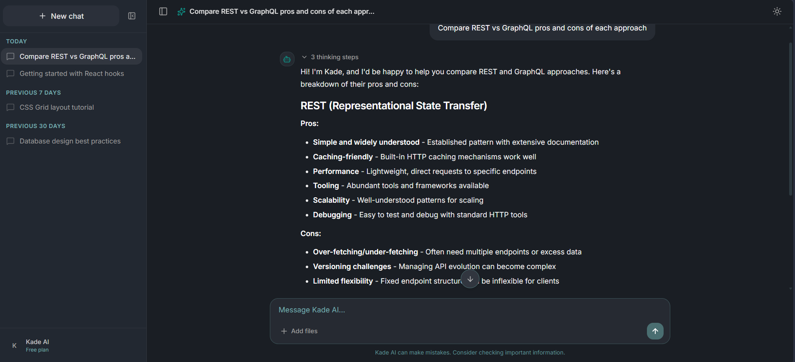

# Kade AI

> **Note:** This project is still in active development. Features are being added and changed regularly. Some things may not work as expected yet.

A modern AI chat interface powered by a local Ollama instance. Features real-time streaming, web search integration, and a clean minimal UI.

## Demo



## Features

- **Real AI Responses** - Connected to Ollama running locally with qwen3-coder:30b
- **Web Search** - Automatically searches the web when you ask about current events, news, prices, or schedules
- **Streaming Responses** - Watch the AI type in real-time
- **Thinking Steps** - Visual progress indicators showing the AI's processing flow
- **Conversation Memory** - Full context awareness across your chat history
- **Dark/Light Mode** - Toggle between themes
- **Markdown Support** - Renders code blocks, tables, lists, and more
- **Responsive Design** - Works on mobile, tablet, and desktop
- **Settings Page** - Profile, appearance, and notification preferences
- **Stop Generation** - Cancel mid-response while keeping what was generated

## Prerequisites

- [Node.js](https://nodejs.org/) (v18 or higher)
- [Ollama](https://ollama.com/) installed and running locally

## Installation

1. Clone the repository

```bash
git clone https://github.com/Saif-jaber/Kade-ai.git
cd Kade-ai
```

2. Install dependencies

```bash
npm install
```

3. Pull the required model in Ollama

```bash
ollama pull qwen3-coder:30b
```

4. Start Ollama (if not already running)

```bash
ollama serve
```

5. Start the development server

```bash
npm run dev
```

6. Open your browser and go to `http://localhost:5173`

## Project Structure

```
src/
├── components/
│   ├── chat/
│   │   ├── ChatArea.jsx
│   │   ├── ChatInput.jsx
│   │   ├── ClarifyingQuestion.jsx
│   │   ├── CodeBlock.jsx
│   │   ├── EmptyState.jsx
│   │   ├── MessageActions.jsx
│   │   ├── MessageBubble.jsx
│   │   ├── MessageList.jsx
│   │   └── ThinkingPanel.jsx
│   ├── common/
│   │   ├── LoadingDots.jsx
│   │   └── ThemeToggle.jsx
│   ├── layout/
│   │   ├── AppLayout.jsx
│   │   └── Header.jsx
│   ├── settings/
│   │   └── Settings.jsx
│   └── sidebar/
│       └── Sidebar.jsx
├── context/
│   ├── ChatContext.jsx
│   └── ThemeContext.jsx
├── services/
│   ├── ollama.js
│   └── search.js
├── workers/
│   └── streamWorker.js
├── App.jsx
├── main.jsx
└── index.css
```

## Tech Stack

- **React 19** with Vite
- **Tailwind CSS 3** for styling
- **Ollama** for local AI inference
- **DuckDuckGo** for web search
- **lucide-react** for icons
- **react-markdown** for markdown rendering

## How It Works

1. You type a message and hit send
2. The app shows thinking steps as it processes
3. If your message needs current information (detected automatically), it searches the web first
4. Search results are passed to the AI along with your message
5. The AI responds with a streaming output
6. Full conversation history is maintained for context

## Building for Production

```bash
npm run build
```

The output will be in the `dist/` folder.

## License

MIT
